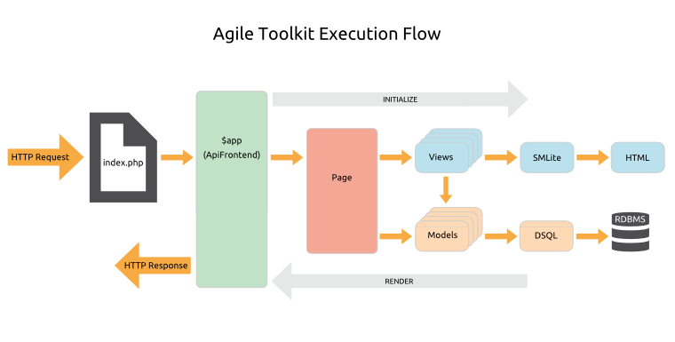
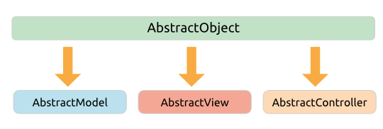
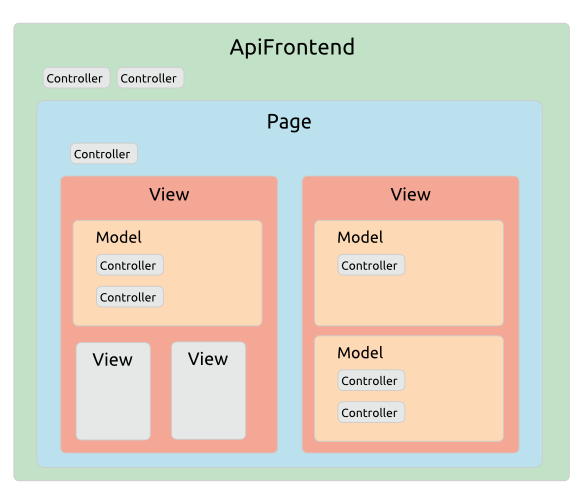

# Architecture & Design > Anatomy Of An Application

## The Execution Process

Let's walk though the basic anatomy of an HTTP request.

1. First, your webserver is configured to run the `index.php` file in your webroot for all page requests. This simply bootstraps your application with 3 lines of code:

    <pre>
    include 'atk4/loader.php';

    // Set up the application object
    $api=new Frontend('sample_project');

    // Run the application
    $api->main();
    </pre>
    
1. `Frontend.php` is known as the `$app` object &ndash; it's the topmost object in the Runtime Object Tree. `Frontend` extends one of the Agile Toolkit API classes, which are tailored to give you just the application features you need for different kinds of request. For example there are APIs for command-line requests and REST requests. For a normal page request you would normally use `ApiFrontend`.

1. In `Frontend.php` you set up your database connections, configure your class loading, and initialize your access security and application-wide Controllers.

1. Now we cascade down the Runtime Object Tree initializing all the objects required to fulfil the request...

1. The `$app` object will route the request to the correct Page class in your `\page` directory, throwing a 404 Page Not Found error if no page is found.

1. The Page will orchestrate the necessary Views and Models, and these will load any Controllers they require.

1. The Views use the SMLite template engine to generate their HTML output, and the Models use the DSQL (Dynamic SQL) Query Builder to generate runtime SQL.

1. Once all objects are initialized, the `$app` will recursively render the nested tree of Views and serve the response.

## The Application Core

The Agile Toolkit Core handles the plumbing of your application. The key features are:

* [Configuration](/TODO): configuring the application and Controllers
* [Class Loading](/TODO): automatic lazy loading of classes as they are called
* [Request Routing](/TODO): loading the correct Page class to handle the request
* [Asset Management](/TODO): serving CSS, JavaScript, image and other media files
* [Event Hooks](/TODO): a callback mechanism for running code at specific points in the execution process
* [Authentication & Authorization](/TODO): controlling access to the application and its features
* [Error Handling](/TODO): help with handling and logging various types of error
* [Testing](/TODO): a simple but rather useful built-in unit testing framework.

## The Application Object

As we've said, the topmost object in the Runtime Object Tree is your `$app` object, which is extended from an API class. Most of the Core features are provided through the `$app` object. 

There are a number of API classes available in the Core, and you can extend them yourself to add any specific features you commonly require. The main Core APIs are:

* [ApiCLI](/TODO): a minimal frontend for command line requests
* [ApiWEB](/TODO): a minimal frontend for web applications, mainly used for integrating with other frameworks
* [ApiFrontend](/TODO): extends ApiWeb with routing, default page layouts and Page classes

There are other more specialised APIs for installers and REST requests.

## The Class Hierarchy

Once your `$app` object is initialised it's time to build your Models, Views and Controllers. In order to achieve the integration required for the high levels of Abstraction, Composability and Extensibility that make Agile Toolkit so productive, we need to provide every object with a number of common features.

So at the top of the class hierarchy is `AbstractObject`, which primarily handles the creation, naming and initialization of objects.

There are three classes which extend directly from `AbstractObject`:

* **AbstractModel**: which adds features to help manage data Entities
* **AbstractView**: which adds features to help generate output
* **AbstractController**: which is the root class for all Controllers. 

All other classes in the Framework and Addons descend from one of these three abstract classes, and all objects in Agile Toolkit are either Models, Views or Controllers.

So while most modern PHP frameworks aim at decoupling their code, Agile Toolkit is a tightly integrated system. Like any design decision this involves tradeoffs: your code is less portable to other frameworks, but in return you enjoy all the unique productivity features of the Toolkit.

## The Runtime Object Tree

In another departure from conventional design, objects in Agile Toolkit are always instantiated inside a parent object using `add()` rather than the PHP `new` statement. Again, this is to assist with our Composability design goal. 

So an Agile Toolkit application is a runtime tree of objects nested inside other objects. This enables us to render our Models and Views recursively into a single integrated request response.  

## Addons

Outside the Core there is a growing ecosystem of Agile Toolkit Addons. Official Addons are included in the distribution in the `atk4-addons` directory. They cover functionality such as internationalisation, integration with external services such as payment gateways and Google maps, and a range of user interface widgets.

We have recently launched an [online Addon marketplace] for community and commercial Addons. It's early days, but we plan to expand this rapidly.
