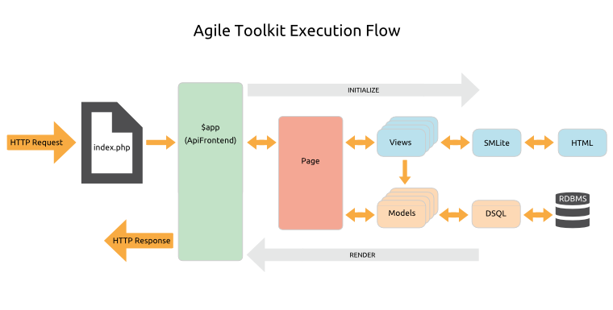

# Architecture & Design > Anatomy Of An Application

## Core Features

The Agile Toolkit Core handles the plumbing of your application. The key features are:

* [Configuration](/TODO): configuring the application and Controllers
* [Class Loading](/TODO): automatic lazy loading of classes as they are called
* [Request Routing](/TODO): loading the correct Page class to handle the request
* [Asset Management](/TODO): serving CSS, JavaScript, image and other media files
* [Event Hooks](/TODO): a callback mechanism for running code at specific points in the execution process
* [Authentication & Authorization](/TODO): controlling access to the application and its features
* [Error Handling](/TODO): help with handling and logging various types of error
* [Testing](/TODO): a simple but rather useful built-in unit testing framework.

## The Execution Process

Let's walk though the basic anatomy of an HTTP request.

1. First, your webserver is configured to run the `index.php` file in your webroot for all page requests. This simply bootstraps your application with 3 lines of code:

    include 'atk4/loader.php';

    // Set up the application object
    $api=new Frontend('sample_project');

    // Run the application
    $api->main();
    
1. `Frontend.php` is known as the `$app` object &ndash; it's the top object in the Runtime Object Tree. `Frontend` extends one of the Agile Toolkit API classes, which are tailored to give you just the application features you need for different kinds of request. For example there are APIs for command-line requests and REST requests. For a normal page request you would normally use `ApiFrontend`.

1. In `Frontend.php` you set up your database connections, configure your class loading and initialize your access security and application-wide Controllers.

1. Now we cascade down the Runtime Object Tree initializing all the objects required to fulfil the request...

1. The `$app` object will route the request to the correct Page class in your `\page` directory, throwing a 404 Page Not Found error if no page is found.

1. The Page will orchestrate the necessary Views and Models, and these will load any Controllers they require.

1. The Views use the SMLite template engine to generate their HTML output, and the Models use the DSQL (Dynamic SQL) Query Builder to generate runtime SQL.

1. Once all objects are initialized, the `$app` will recursively render the nested tree of Views and serve the response.

## The Application Object

## The Runtime Object Hierarchy

## Pages
