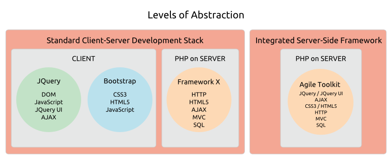

# Architecture & Design > Design Goals

## What Challenges Is Agile Toolkit Designed To Solve?

Agile Toolkit is a new kind of PHP framework focused on easing the development of rich-client AJAX applications. 

The increasing importance of desktop-like AJAX interfaces is a game-changer for PHP application developers:

* Rich interfaces require complex HTML5 and CSS3
* We need non-trivial JavaScript in the client to enforce business rules, handle events and bind data structures to the interface
* We need to move data between the database, our PHP server-side objects and our JavaScript in the client
* For security, we need to double-check client-side business rules on the server
* And we have to tie all this together with AJAX calls in both directions.

The PHP community offers an exceptional choice of well-engineered MVC frameworks, but even the best can only offer a partial solution to the many challenges of developing rich-client applications.

With some frameworks you create your AJAX data management system though code generation, and this can work well for straightforward requirements. But your application design is constrained by the features built into the generator, and you can end up adapting more complex projects to the framework rather than the framework to the project.

The other main option is a multi-framework development stack. Typically this involves a PHP MVC framework on the server-side, a JavaScript user interface framework such as JQuery UI on the client-side, and perhaps a CSS framework such as Bootstrap to ease the styling headache. But now you're working with two or three complex and overlapping frameworks in different languages, and you're still having to figure out your own way to tie them together with AJAX. It's a challenge to keep things [DRY](http://en.wikipedia.org/wiki/Don't_repeat_yourself) and avoid duplicating effort on the client and the server. The learning curve is steep. And the resulting code can be hard to test and tricky to change as requirements evolve. 

Neither of these solutions met the needs of our busy web development house. So we set out to build a more integrated, flexible and reliable approach to developing rich web applications.

## What Benefits Does Agile Toolkit Deliver?

With so many excellent PHP frameworks, any new project has to justify its existence by delivering dictinctive and compelling benefits.

Our inspiration has been desktop GUI frameworks such as Cocoa, QT and .Net. Compared to mainstream PHP frameworks, these offer a notably easier route to building rich applications:

* They abstract away most of the complexity of full-featured GUIs without sacrificing flexibility, freeing the developer to focus on business functionality rather than low-level nuts and bolts
* You do your work in a single language and access the framework functionality through a single API
* You create a rich user experience by plugging together and configuring well-tested GUI components
* You develop new GUI components by combining sub-components
* You can plug in additional functionality through a thriving ecosystem of open source and commercial addons
* The GUI is nicely styled by default and is easy to re-skin
* And on the business side, your data structures bind seamlessly to your interface widgets.

Agile Toolkit offers all of these benefits to developers building data-centric AJAX applications in PHP. 

We call our solution a Toolkit rather than a framework because the focus is on rapid development with reusable interface and business components. And we call it Agile because the components are designed to adapt easily and reliably as agile requirements evolve.

In practice, you'll be working with:

* **A fresh approach to Views**: building a rich user experience by snapping together flexible, event-aware View components using only PHP ([see more...](/TODO)) 
* **A fresh approach to Models**: building your business logic in Models that plug directly into your View components and adapt robustly as requirements evolve ([see more...](/TODO)) 
* **A fresh approach to Addons**: plugging in additional functionality from an ecosystem of Addons that take full advantage of the event handling and styling features of the Toolkit Core ([see more...](/TODO)).

So what is the payoff for you, the developer? Quite simply, AJAX applications that are:

* Easier to build
* Easier to test
* And easier to change.

### Example: a full-featured CRUD application in just TODO lines of code

To whet your appetite, here's a complete [CRUD](http://en.wikipedia.org/wiki/Create,_read,_update_and_delete) system for a `user` table, with searching, browsing, sorting, paging, creating, updating, deleting, validation and localized user error messages. With some popular frameworks this would require dozens, even hundreds of lines of code. Not with Agile Toolkit:

<?-- Would it be better to show them a relational example with master-detail? Even more impressive? ?>

    TODO
    // Let's set up a data Model
    // Now we'll add some validation rules
    // We plug our Model into the Agile Toolkit CRUD Addon
    // And configure some additional UI functionality

That's all there is to it. Every aspect of the functionality and look-and-feel can be customized with ease &ndash; you can even swap in a different grid component! And this is what you get in just xx lines of code &ndash; a full-featured, attractive data entry system that's ready to go:

    TODO
    // Screenshot? Screencast? Live demo?

## How Does Agile Toolkit Deliver These Benefits?

New benefits require new approaches. The techniques are widely used in desktop frameworks, but may be unfamiliar to web developers.

You'll find the Toolkit easier to learn if you understand the four key engineering principles it's built on.

### The Abstraction Principle

We abstract all the technologies of the client-side and the server-side behind a consistent PHP interface. You lay out your data entry system, define UI behaviour and handle client-side events using PHP on the server.

Years of experience with demanding Agile projects has proven that this radical level of abstraction shortens the learning curve, simplifies development and eases testing.

### The Composability Principle

The Toolkit is designed from the ground up to help developers compose View components from smaller sub-components. Component-focused development shortens delivery cycles and increases reliability, and it's Composability that makes this possible.

Techically, Composability requires components that are independent, keep track of their own state and know how to cooperate with each other. Much of the design of Agile Toolkit is focused on achieving these requirements.

Composability isn't restricted to View components &ndash; Models are composable too. So you can build complex business rules from simpler sub-components.

With Agile Toolkit you can quickly develop a range of flexible business and interface components to meet the repeating requirements of your problem domain.

### The Extensibility Principle

Composability is only the first step to a truly Agile web framework. In many ways the toughest challenge is adding functionality to your components as your application evolves.

This is where you need [Extensibility](http://en.wikipedia.org/wiki/Extensibility) &ndash; the ability to add new functionality without breaking existing tested code.

To achieve Composability our Model and View objects store their parameters and only render output at the last moment, once they know what other objects they're working with. So all their settings can be changed at any stage before they render. 

This means that when you extend an object any of its settings can be modified to provide different or additional functionality without breaking the existing, tested, parent object.

In general, best practice in Agile Toolkit is to add new functionality by extending the existing object, without disrupting its code and tests. The Extensibility features are designed to ensure that this process is rapid and reliable.

Our focus on Composability and Extensibility means that everything in Agile Toolkit is an object &ndash; there's no use of static classes. Any component can be reconfigured or swapped out at runtime, so the Toolkit is a software tester's dream! 

### The Simplicity Principle

Finally, working with web frameworks you can sometimes feel that they're making simple things complex. With Agile Toolkit we strive to avoid this by always adopting the simplest practical approach, even if it's not the 'purest' or trendiest. For example:

* Configuration files are plain old PHP hashes, so if you want complex conditional configurations just pop in some code.
* You won't need namespacing unless you're using Addons or external libraries. This has never caused any practical problems and we avoid tedium like this:

    <pre>
    namespace Acme\TaskBundle\Controller;

    use Symfony\Bundle\FrameworkBundle\Controller\Controller;
    use Acme\TaskBundle\Entity\Task;
    use Symfony\Component\HttpFoundation\Request;
    </pre>

* We use directories in the file system to define our routes without complex configuration conventions, just as HTTP intended.

You'll find this kind of pragmatic thinking throughout the codebase. It helps to keep the code lean and the learning curve manageable.
