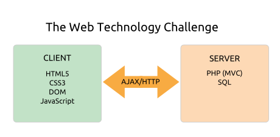

# Architecture & Design > Distinctive Design Goals

## What Challenges Does Agile Toolkit Solve?

Agile Toolkit is designed to help developers of data-intensive web applications solve three of their greatest challenges:

+ Rich web interfaces
+ Agile development
+ Code reusability

### Rich web interfaces are hard

The increasing importance of desktop-like AJAX interfaces is a game-changer for PHP developers. Nowadays you'll typically be juggling with a veritable smörgåsbord of technologies:

+ HTML5 & CSS3 for the client interface
+ JavaScript for client interactivity
+ A PHP MVC framework on the server side
+ Perhaps some raw SQL in the data layer
+ And client-server AJAX calls to tie the whole thing together

This complexity makes modern rich web applications hard to author, hard to test and hard to change.

### Agile development is hard

The benefits of [Agile development](http://en.wikipedia.org/wiki/Agile_development) are increasingly understood, but until now PHP frameworks haven't really evolved to meet the new demands of Agile processes. 

Ideally we want to incrementally add business and interface functionality without breaking our working code, and to plug together the work of different developers or teams for frequent releases with minimal integration headaches.

How much help does your current framework offer with these Agile challenges?

### Code reusability is hard

This was the great promise of object-oriented design, but long experience has proved that effective reuse is a truly hard problem. 

One of the most successful approaches is component reuse: this works well in desktop GUI frameworks, for example, where it's pretty easy to snap together and configure tested subcomponents to form complex interfaces. 

But few PHP application frameworks offer much help if you want to build truly flexible business or interface components.

### The need for a fresh approach

As we've seen, the demands on developers are evolving rapidly, but there's been surprisingly little innovation in the world of PHP application frameworks. The focus is on server-side implementations of the [MVC pattern](http://en.wikipedia.org/wiki/MVC_Pattern) (Model, View, Controller) and most of the main players seem to be converging on a very similar approach, to the point that their libraries are becoming increasingly interchangable. There have been major improvements in the field of testability, but in most other respects the MVC frameworks of today are quite similar to the previous generation. 

So measured against the challenges of rich applications, Agile development and code reusability, how much practical payoff is your big full-stack MVC framework really offering in return for the complexity and learning curve? It's a question that many are  asking with increasing concern, and we even have community gurus such as Rasmus Lerdorf (the original author of PHP) arguing that you're better off with a [no-framework](http://toys.lerdorf.com/archives/38-The-no-framework-PHP-MVC-framework.html) approach.

But this is surely a counsel of despair. What we really need is a radical rethink of the purpose of PHP application frameworks to ensure that they offer practical help with the really hard problems of rich application development.

## How Does Agile Toolkit Tackle These Challenges?

Compared to a typical PHP MVC framework, the design of Agile Toolkit is quite radical. Our choices have been driven by three overriding goals:

+ Harnessing the power of **Abstraction** so developers can work with the web technology smörgåsbord through a consistent PHP API
+ Harnessing the power of **Composability** so developers can build complex business and interface components from smaller, tested subcomponents
+ Harnessing the power of **Extensibility** so developers can add new functionality to their components with ease as Agile requirements evolve.

### The power of Abstraction

Typically developers will use: 

* A PHP MVC framework to help abstract away HTTP, HTML5, SQL and server-side AJAX
* A JavaScript toolkit such as [JQuery](http://jquery.com/) to help abstract away JavaScript, the DOM and client-side AJAX
* And a front-end framework such as [Bootstrap](http://twitter.github.com/bootstrap/) to help abstract away CSS3.

This helps bring the technology smörgåsbord under control, but working with three complex and overlapping frameworks in three different languages is still a pretty major headache.

We developed Agile Toolkit to abstract all these technologies into one integrated and constent PHP framework:

* Managing the server-side with MVC refactored for the demands of Agile, component-driven development
* Setting up your JQuery and JQuery UI code and handling client-side events using PHP on the server-side
* Styling your interface components with a fully-integrated, skinnable CSS3 framework
* And handling the AJAX complexity required to plumb the client into the server.

Years of experience with demanding Agile projects has proven that this radical level of abstraction simplifies development and eases testing.

### The power of Composability 

As developers we learned our trade using GUI frameworks such as Cocoa, and when we switched to the web we wondered why user interface development had to be so hard. So we've adapted techniques from desktop GUI frameworks to the client-server world of web applications.

On the desktop you build complex GUI components from simpler, tested subcomponents such as buttons, fields, data grids, forms and tabs. Our goal for Agile Toolkit was to make it equally easy to build interactive, event-aware interface components using HTML5, CSS3, JavaScript and AJAX. 

Achieving this required a radical design. In Agile Toolkit, you don't create objects with the PHP `new` statement. All objects are embedded into a parent object using an `add()` method, so the whole application is a single object tree. And objects are initialized using an `init()` method rather than the PHP `__construct()` method so we can give each component a unique id within the system before we set it up. 

This means that interface objects know how to render their children and access them dynamically with JQuery. For example you can create a form, plug in layers of interactive, event-aware subcomponents, write your event handling code in PHP and the whole thing will render and run. It all just works.

From there it's a short step to realizing that SQL queries can also be rendered from nested templates, so we built Agile ORM, an object-relational mapper that allows you to compose queries from smaller query components such as expressions and subqueries.

It's a new world for PHP and you're going to love it! To give you a taste of the power of Composability, here's a complete [CRUD](http://en.wikipedia.org/wiki/Create,_read,_update_and_delete) system for a `user` table, with searching, browsing, sorting, paging, creating, updating, deleting, validation and localized user error messages. It's built with an Addon component composed of a wide range of subcomponents.

    TODO, with the new declarative validation plugin

### The power of Extensibility

But Composability is only the first step to a truly Agile web framework. In many ways the toughest challenge is adding new functionality to your components as your application evolves.

This is where you need Extensibility &ndash; the ability to add new functionality without breaking existing tested code.

To achieve Composability we designed our business and interface objects so they store their parameters and only render output at the last moment, once they know what other objects they're working with. So all their settings can be changed at any point. 

This means that any object can be extended and its settings modified to provide additional functionality without breaking the existing, tested, parent object.

Say, for example, you have a `user` Model handling your business rules and actions for application users. Then the client decides that they also need a `superuser` entity. A `superuser` does some things the same way as a `user`, some things differently, and can also do some new actions not shared with a `user` and which use different fields. With most ORMs this wouldn't be easy to achieve without disrupting existing code and tests. With Agile Toolkit, it's easy to extend your Model to add the new requirements:

    TODO: example

Any code using the parent `user` Model will continue to work, because nothing has changed. And there's no danger that new code using the the `superuser` Model will inadvertantly apply `superuser` operations to a `user` because you changed the query conditions to select only `superusers`: there's a clean separation of concerns. Your old `user` tests continue to run, and you add specific tests for the new `superuser` functionality. So changing your code is easy, robust and safe. This is the power of Extensibility.

As an important side effect, this means that Agile Toolkit is radically injectable: any object can be swapped out or reconfigured at any stage with no need for any special planning or configuration. So it's a software tester's dream!

## The Power Of Simplicity

To summarize, our aim is to simplify the process of developing data-intensive rich web applications. Frankly, with some of the leading PHP frameworks there are times when we feel they're making simple things complex. With Agile Toolkit, our focus is always to make complex things simpler:

* It's simpler to build rich web interfaces
* It's simpler to build reusable business and interface components
* And its simpler to adapt your components as Agile requirements evolve.

This focus on simplicity extends to the code itself. The core focuses on the 20% of functionality that's needed for almost every project, with everything else offered as an optional Addon. And we always adopt the simplest practical approach, even if it's not the trendiest. For example:

* Configuration files are plain old PHP hashes, so if you want complex conditional configurations just pop in some code.
* Namespacing isn't used within the core and application code unless you're using Addons or external libraries. It's never caused any practical problems and we avoid tedium like this:

    <pre>
    namespace Acme\TaskBundle\Controller;

    use Symfony\Bundle\FrameworkBundle\Controller\Controller;
    use Acme\TaskBundle\Entity\Task;
    use Symfony\Component\HttpFoundation\Request;
    </pre>

* We use good old $\_GET and $\_POST rather than some kind of complex request object.

You'll find this kind of pragmatic thinking throughout the codebase. It helps to keep the code lean and the learning curve low.

Radical new benefits require radical new approaches. As you dig into these docs you'll find there's much about Agile Toolkit that's unfamiliar &ndash; it's not hard to learn but it does require some new thinking. So do please bear the purpose in mind: once you undestand the way that Agile Toolkit handles Abstraction, Composability and Extensibility you'll find that development is a simpler, faster and more reliable process.
