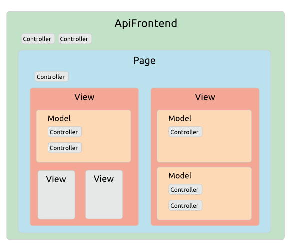

# Framework Structure > Working With Framework Objects

## Overview

In this section we cover the fundamental principles for working with objects in Agile Toolkit. The techniques are straightforward but will be unfamiliar to most developers. So a thorough understanding of the material here is essential for achieving comfort and fluency with the framework.

## The Class Hierarchy

At the top of the class hierarchy is `AbstractObject`, which offers a number of core services that we cover in this section.

There are three classes which extend directly from `AbstractObject`:

* **AbstractModel**: which adds features to help manage data Entities
* **AbstractView**: which adds features to help generate output
* **AbstractController**: which is the root class for all Controllers. 

All other classes in the Framework and Addons descend from one of these three abstract classes.

So while most modern PHP frameworks aim at decoupling their code, Agile Toolkit is a tightly integrated system. Like any design decision this involves tradeoffs: your code is less portable to other frameworks, but as you will see throughout these docs, the features offered by these abstract objects offer a great deal in terms of agility, reliability and resuablity.

## Application Structure

In another departure from conventional design, objects in Agile Toolkit are always instantiated inside a parent object.

At the top of the runtime object tree is your application object, which provides fundamental services such as routing, object initialization and output rendering.

### The application object

### The runtime object hierarchy

### Object Properties

Property Description
    short_name System object name which identifies objects through it's parentrent's "element" array. If you have to change the name, use rename().
    name Unique object name. No two objects in the system will have the same name.
        elements Array containing references to all child objects. Since 4.2,   some objects may be "detached" in which case instead of a reference, the elements array will contain "true" value. This helps conserve memory.
        owner Always pointing to object which created this object through   the call to add()
    api Always points to application object, the top-most object (routingot)
    model Points to "model" object, set with setModel()
        controller Points to "controller" object, set with setController()
        Authenticationo_track_element Regulates if adding this object will automatically incominglude link in owner's elements[] array. If set to false, object will be "detached"

## Adding Objects

Typically in PHP you create an object directly with the `new` statement:

    $bar = new foo;
    $bar->do_foo();

In Agile Toolkit, objects are **never** created this free-floating way. The AbstractObject provides all classes with an `add()` method which embeds the object into the scope of its owner. 

    $new_object = $owner->add('MyClass');

For example, you might `add()` a button to a View object or a query to a Model object. This is primarily to assist with our goal of Composability, so objects know how to combine themselves into components.

Objects know the owner-object they were added into:

    $new_object->owner === $owner;

## Object Naming
## Initializing Objects
## Cloning Objects
## Addons & Namespaces
