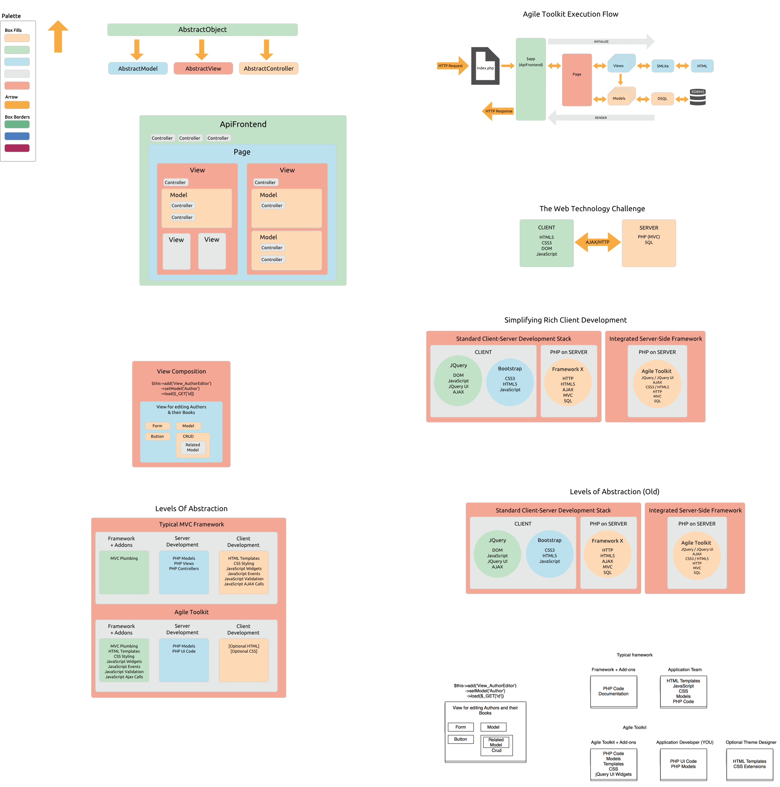
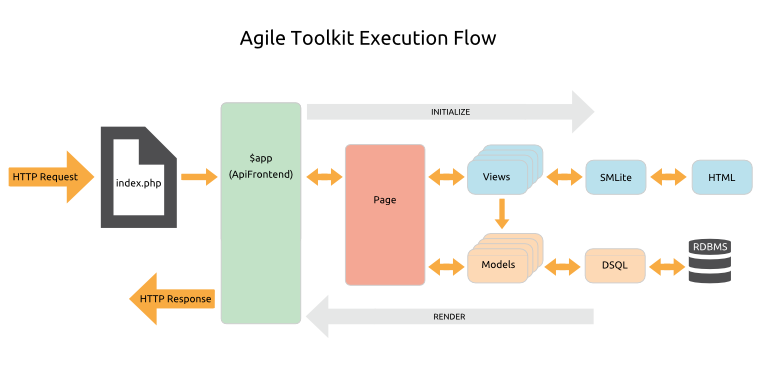

# Overview > Anatomy Of An Application

## The Class Hierarchy

To implement the [Composability](/TODO) and [Extensibility](/TODO) that make Agile Toolkit so productive we need to provide every object with a number of common features.

So at the top of the class hierarchy is `AbstractObject`, which primarily handles the creation, naming and initialization of objects.

There are three classes that extend directly from `AbstractObject`:

* **AbstractModel**: which adds features to help manage data entities
* **AbstractView**: which adds features for generating user interface output with nested templates
* **AbstractController**: which is the root class for all Controllers. 

All other classes descend from one of these three abstract classes, so all objects in Agile Toolkit are either Models, Views or Controllers.

While most modern PHP frameworks aim at decoupling their code, Agile Toolkit is a tightly integrated system. Like any design decision this involves tradeoffs: your code is somewhat less portable to other frameworks, but in return you enjoy the unique productivity features of the Toolkit and a high level of integration for Addons.

## The Runtime Object Tree

In a related departure from conventional design, objects in Agile Toolkit are always instantiated inside a parent object using the `AbstractObject add()` method rather than the PHP `new` statement. Again, this is to assist with our Composability design goal. 

So an Agile Toolkit application is a runtime tree of objects nested inside other objects. This enables us to render the nested components of our Models and Views recursively into a single integrated request response.  

## How Models Views and Controllers are connected

Strictly speaking, Views in Agile Toolkit are often "Presenters" (especially when View is using composition), while Model and Controller can be optional. As a UI developer, your primary task is to add a proper view inside another view and associate it with proper model. Agile Toolkit may add one or few controllers along the way as a "grease" to help View work with your Model better.

We define the top-most object, an Application also as a View. This view would contain a Page View which then may contain CRUD View which contain Form View which contain Fields and Buttons Views.

In this typical tree some of the complex views would be associated with Model (CRUD and Form) and other views may contain controllers (DB and Logger in Application).

## The Execution Flow
 Agile Toolkit does not use Singletons or static methods and this allows you to actually initialize multiple "Application" classes and even run them side-by-side. Advanced techniques like that enable some powerful application debugging capabilities, contextual testing and many other useful patterns.

- Application class is dirrevative of a View. Rendering your application will produce complete HTML which is sent to the browser.

Now you understand the Runtime Object Tree we can walk though the basic anatomy of an HTTP request.

1. First, your webserver is configured to run the `index.php` file in your webroot for all page requests. This simply bootstraps your application with 3 lines of code:

    <pre>
    include 'atk4/loader.php';

    // Set up the application object
    $api=new Frontend('sample_project');

    // Run the application
    $api->main();
    </pre>
    
1. `Frontend.php` is known as the `$app` object &ndash; it's the topmost object in the Runtime Object Tree. `Frontend` extends one of the Core API classes, which are tailored to give you just the application features you need for different kinds of request, such as Command Line requests or REST requests. For a normal page request you would generally use `ApiFrontend`.

1. In `Frontend.php` you set up your database connections, configure your class loading, and initialize access security and application-wide Controllers.

1. Now the application cascades down the Runtime Object Tree initializing all the objects required to fulfill the request...

1. The `$app` object will route the request to the correct Page class in your `/page` directory, throwing a 404 Page Not Found error if no matching page is found.

1. The Page will orchestrate the necessary Views and Models, and these will load any Controllers they require.

1. The Views use the SMlite template engine to generate their HTML output, and the Models use the DSQL (Dynamic SQL) Query Builder to generate runtime SQL.

1. Once all objects are initialized, the `$app` will recursively render the nested tree of Views and echo out the response.

## The Application Core

The Agile Toolkit Core sits in the `/atk4` directory and handles the plumbing of your application. The key features are:

* [Configuration](/TODO): configuring the application and Controllers
* [Class Loading](/TODO): automatic lazy loading of classes as they are called
* [Request Routing](/TODO): loading the correct Page class to handle the request
* [Asset Management](/TODO): serving CSS, JavaScript, image and other media files
* [Event Hooks](/TODO): a callback mechanism for running code at specific points in the execution process
* [Authentication & Authorization](/TODO): controlling access to the application and its features
* [Error Handling](/TODO): help with handling and logging various types of error
* [Testing](/TODO): a simple but rather useful built-in unit testing framework.

## The Application Object

As we've said, the topmost object in the Runtime Object Tree is your Application object `$api`, which is extended from an API class. Most of the Core features are provided through this object. 

There are a number of API classes available in the Core, and you can extend them yourself to add any specific features you commonly require. The main Core APIs are:

* [ApiCLI](/TODO): a minimal frontend for command line requests
* [ApiWEB](/TODO): a minimal frontend for web applications, mainly used for integrating with other frameworks
* [ApiFrontend](/TODO): a comprehensive API for web applications, extending ApiWeb with routing, an integrated CSS styling system, and Page classes

There are other more specialized APIs for installers and REST requests.

API classes descend from `AbstractView`, because they are generally used to create output.
