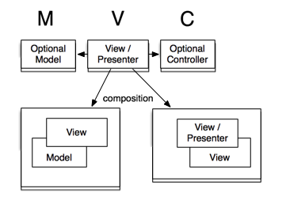

# Overview > A Fresh Approach To MVC

## The Agile Toolkit Approach To MVC and Presenters

Agile Toolkit has refactored the MVC pattern to better meet the realities of rich application development. It takes a highly opinionated approach to MVC, building it into the object structure of the framework. Every line of code you write (excluding Exceptions) is descended from an `AbstractModel` class, an `AbstractView` class, or an `AbstractController` class. So everything in your application is either a Model, a View or a Controller. 

Each of these components has a well-defined role, so in Agile Toolkit it's usually pretty clear what should go where. This architectural consistency helps when working with teams or sharing code with the community.

But it's important to note that the division of labor between Models, Views and Controllers is different from the typical MVC framework. 

## How Models Views and Controllers are connected

Strictly speaking, Views in Agile Toolkit are often "Presenters" (especially when View is using composition), while Model and Controller can be optional. As a UI developer, your primary task is to add a proper view inside another view and associate it with proper model. Agile Toolkit may add one or few controllers along the way as a "grease" to help View work with your Model better.

We define the top-most object, an Application also as a View. This view would contain a Page View which then may contain CRUD View which contain Form View which contain Fields and Buttons Views.

In this typical tree some of the complex views would be associated with Model (CRUD and Form) and other views may contain controllers (DB and Logger in Application).

## What Is a Model In Agile Toolkit?

In Agile Toolkit, a Model encapsulates: 

* The data structure of an entity
* The business logic that's specific to that entity
* Definition of persistent external storage
* Record-level access

You'll build your relational Models with [Agile ORM](/TODO), an [object-relational mapper](http://en.wikipedia.org/wiki/Object-relational_mapping) offering an innovative blend of simplicity, flexibility and power or using a basic [support for NoSQL](/TODO) compatible with wide array of non-relational databases.

Models implement our [Composability](/TODO) design principle: Models consist of Fields which can be associated with other Models. For example `Model_Book` may contain a field `author_id` which references `Model_Author` and Form will automatically use a drop-down (or auto-complete) allowing you to select a relevant entry from related model. Through add-ons you can add support for much more advanced fields such as `Image` which is uploaded, cropped thumbnailed and stored in unique folder then associated with your model entirely behind the scenes following best principle of [Abstraction](/TODO)

And crucially, models also implement our [Extensibility](/TODO) principle. Because you can reconfigure all aspects of your queries Agile ORM Models can be easily extended to deal with evolving use-cases without refactoring your existing code.

For example, a `user` Model could be extended into a `superuser` Model, an `active_user` Model, and an `admin_user` Model, or whatever your application requires. Any behavior common with the parent can be reused or overridden, and new actions can be added to work with any subset of the relevant fields. A powerful feature of extended Models is the ability to add filters to ensure that only entities with the correct charateristics can be modified by the extended object, eliminating a whole class of bugs. 

Furthermore you can use hooks to supply actions which Model performs at certain times, such as afterLoad or beforeSave.

In Agile Toolkit, best practice for adding new functionality generally involves extending existing code rather than refactoring the original object. The parent Model and its tests remain intact and classes using the parent continue to work  correctly. The new functionality is encapsulated in the extended Model and can be tested separately. There's a clean separation of concerns highly suitable for Agile development and clearly implementing our [Testability](/TODO) principle.

The combination of Model Composability, Model Extendability and the ability to inject reusable business logic into Models with Controllers (as explained below) helps ensure that your Toolkit Models will remain lean, agile and reliable.

## What Is A View In Agile Toolkit?

In many MVC frameworks the View is defined as the complete response to a requested URL. 

In Agile Toolkit a View is an object capable of rendering itself, typically into HTML. Instead of having one View/Template per page, you can now have as many as you wish. 

* **A low-level component** such as a button, a dropdown menu or a search box 
* **A composite component** such as a form or multi-featured grid composed from low-level View components and simpler composite components.

Views are independent of each other and can be plugged together freely. When the response is fully configured, complex trees of Views are rendered automatically for output.

Views also implement our [Abstraction](/TODO) design principle:
You lay out your interface, define widget behavior, bind data and handle events exclusively on the server using PHP. All the tiresome AJAX plumbing is handled for you under the hood, and everything simply works. 

Even if you're a JavaScript guru and are rather use JavaScript-based grid (such as jqGrid), Agile Toolkit can help you too. You will encapsulate your JavaScript dependencies into a PHP object allowing any user from Agile Toolkit community to simply "add" your grid anywhere and have it work consistent to a basic grid. Agile Toolkit is smart enough to handle the interactions between your interface objects with minimal developer input:

    // Show a flyout message when file upload completes

    $upload = $this->add('FileUploadComponent');
    $flyout = $this->add('FlyoutComponent');
    $upload->js('completed', $flyout->showJS());

Views also implement our [Extensibility](/TODO) principle: any aspect of any View component can be reconfigured with ease in a reusable extended class.

Naturally, you can bind a Model to a data-aware View component with a single line of code, and the View will adapt to its structure.

    $grid->setModel('Product');
    $grid->addPaginator(5);

Paginator in Grid is implemented as a separate view and enables AJAX communication between the browser and Grid as you paginate. You don't need to teach Grid how it can communicate with the PHP class, Agile Toolkit already does it for you.

Finally, Views are automatically styled with an integrated Bootstrap-compatible CSS framework based on jQuery UI themeroller, which [can be used](http://jqueryui.com/themeroller/) to theme your installation of Agile Toolkit.

## What Is A Page In Agile Toolkit?

Agile Toolkit offers a special type of View called a Page, designed as the end-point of an HTTP request. Requests are routed to Page objects, which marshal the Models and Views required to generate the response, run the rendering and serve the output.

## What Is A Controller In Agile Toolkit?

In Agile Toolkit **Controllers do not coordinate the response to HTTP requests** &ndash; this would normally be handled by Pages. Instead, Controllers encapsulate reusable services or business logic that can be embedded into multiple Models or Views. These can be:

* **Business logic**, such as shipping cost calculators
* **Wrappers** for external APIs such as email broadcasting, social networks or payment gateways
* **Service classes** for coordinating complex interactions between multiple Models
* **Utility classes**, such as loggers or libraries for encryption and date manipulation
* **Object configurators**, such as a class to add standard audit fields to Models.

Controllers can be thought of as similar to the Traits feature introduced in PHP 5.4, where bundles of methods can be embedded within multiple classes.

And with Agile Toolkit's [Runtime Object Tree](/TODO) it's easy to ensure that Controller functionality is accessible wherever it's needed without any need <!-- needed need --> for static methods.

## A Fresh Approach To Addons

A critical aspect of an MVC architecture is the ability to plug in additional View and Model components of any complexity.

Here too Agile Toolkit takes a fresh approach aimed, as always, at improving Composability and Extensibility.

With mainstream PHP frameworks the recent emphasis has been decoupling functionality into standalone [PSR-compliant](https://github.com/php-fig/fig-standards/tree/master/accepted) libraries. A good way to browse and install decoupled libraries is [www.packagist.org](http://packagist.org). Agile Toolkit natively support PHP Composer and you can install any of addons available through Packagist.

By contrast, Agile Toolkit native Add-ons are designed to rely on Agile Toolkit base classes. Such an add-on is likely to offer you new Models and Views classes and is highly coupled to the Toolkit. Installing "User Management" add-on might contribute few significant classes into your application - Models, Views, Controllers and other helpers. Naturally you can also use supplied View with your own User model and all the involved views adapt to your data structure.

There's a growing ecosystem of Agile Toolkit Addons. After installing Agile Toolkit, you can use a native User Interface to browse and install more add-ons from either packagist.org or agiletoolkit.org.

<!-- Will this be launched in time? -->
<!-- yes -->

## Do you find yourself sceptical of this approach?

MVC is a loosely defined pattern, and many developers have become comfortable with their own interpretation. Sometimes newcomers to the Toolkit get stuck trying to square our approach with their own theoretical views on MVC. We urge you not to overthink the issue until you've had some hands-on experience of the practical advantages this approach in action. It evolved over a decade of corporate consulting and has proven its effectiveness with challenging Agile projects. 
